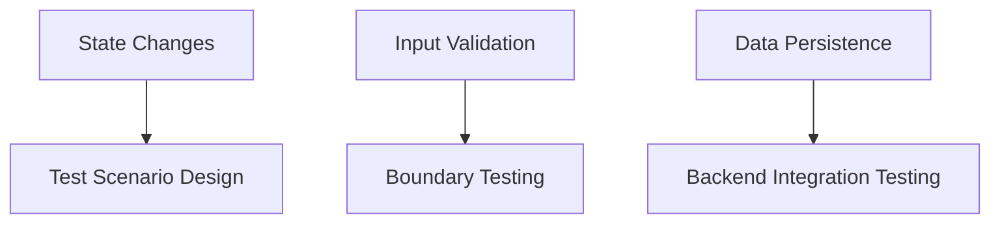
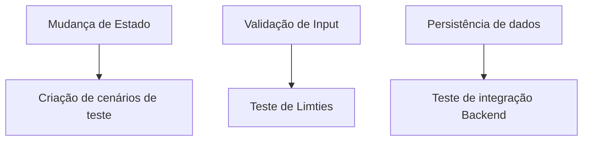

# ✅ Todo-List (JavaScript)  
Project focused on state management and CRUD | Projeto focado em gerenciamento de estado e CRUD  

[EN-US](#en) | [PT-BR](#pt-br)  

---

## 🛠️ Technical Skills Demonstrated  
- **State Management**: Task status toggling (active/completed)  
- **CRUD Operations**: Create, Read, Update, Delete tasks  
- **Local Storage**: Persistent data handling  
- **Input Validation**: Empty task prevention  
- **DOM Updates**: Dynamic list rendering  

## 🎯 Relevance for QA Automation  

Testing Patterns:
Each CRUD operation mirrors test cases for:

E-commerce carts (add/remove items)

User profile updates

State Validation:
Toggling task status = testing UI state changes in automation tools

Edge Cases:
Empty input handling = testing form validation boundaries

▶️ [Live Demo](https://derre3.github.io/todo-list/)

---

🛠️ Habilidades Técnicas Demonstradas
Gerenciamento de Estado: Alternância entre tarefas ativas/concluídas

Operações CRUD: Criar, ler, atualizar e excluir tarefas

Local Storage: Armazenamento persistente de dados

Validação de Inputs: Prevenção de tarefas vazias

Atualizações de DOM: Renderização dinâmica da lista

## 🎯 Relevância para Automação de QA

Padrões de Teste:
Cada operação CRUD reflete casos de teste para:

Carrinhos de e-commerce (adicionar/remover itens)

Atualizações de perfil de usuário

Validação de Estados:
Alternar status de tarefas = testar mudanças de estado em ferramentas de automação

Casos Extremos:
Tratamento de inputs vazios = testar validação de formulários

▶️ [Demo Online](https://derre3.github.io/todo-list/)

---

🔧 Tech Stack | Tecnologias
JavaScript Webpack LocalStorage CSS Flexbox
